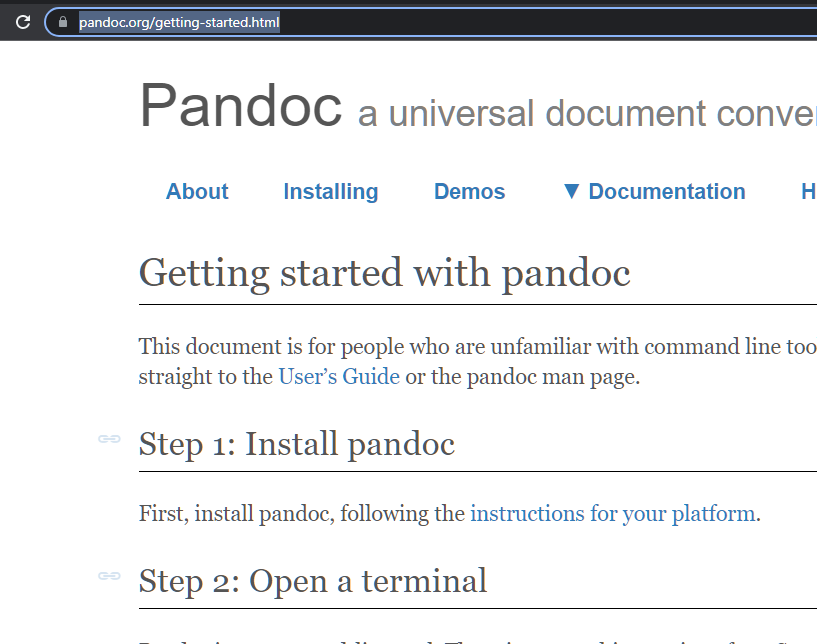
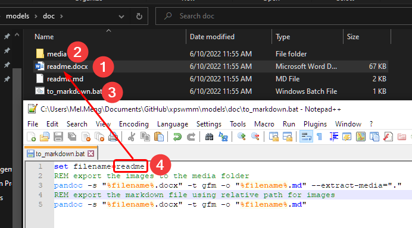
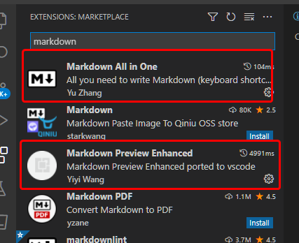
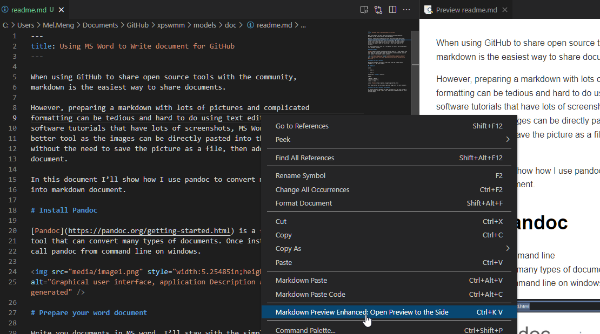

When using GitHub to share open source tools with the community,
markdown is the easiest way to share documents.

However, preparing a markdown with lots of pictures and complicated
formatting can be tedious and hard to do using text editors. For the
software tutorials that have lots of screenshots, MS Word is a much
better tool as the images can be directly pasted into the document
without the need to save the picture as a file, then added to the
document.

In this document I’ll show how I use pandoc to convert my word document
into markdown document.

# Install Pandoc

[Pandoc](https://pandoc.org/getting-started.html) is a free command line
tool that can convert many types of documents. Once installed, you can
call pandoc from command line on windows.

# Prepare your word document

Write you documents in MS word, I’ll stay with the simple styles
(heading 1, 2, …). For example,

## Heading 2

Lists,

-   Item 1

-   Item 2

Style text: **Bold,** *Italic*

Tables

| Header | Header |
|--------|--------|
| Cell 1 | Cell 2 |

Links: [Pandoc](https://pandoc.org/getting-started.html)

Most importantly, you can simply paste an image into the word document.

# Convert your word document to markdown

To convert the word document,

1.  Save the word document in the folder

2.  Create a media folder to store all the images

3.  Create a \*.bat file to convert the word file to markdown

4.  Update the file name to match the word file name

Run the \*.bat file, you should have a \*.md file generated with the
images saved in the media folder.

# Review the markdown

I use VS Code to edit and review markdown file, which has lots of
extensions for markdown, the two extensions I used are “Markdown All in
One” and “Markdown Preview Enhanced”

As you can see from this example, Pandoc did a pretty good job
converting the word document to markdown, there is very little clean up
needed.
